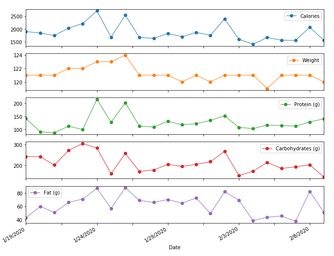

# Download from google spreadsheet and stack plot the data

This is a tiny script that Youlin wrote to track long term fat loss progress. 

Workflow:

- track macros in `my fitness pal`
- export data and copy paste info to google sheet (unfortunately they seem to only support export to email)
- follow [gspread](https://github.com/burnash/gspread) instructions here.
- run `main.py`

